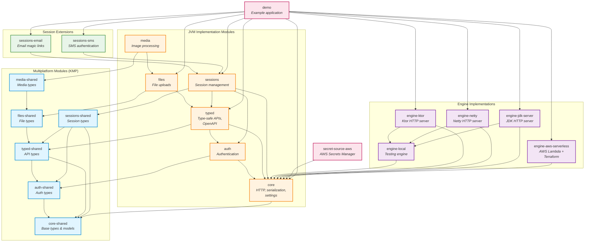

# Lightning Server Module Architecture

This document provides a visual overview of the module structure and dependencies in Lightning Server.

## Module Dependency Graph



## Module Categories

### Multiplatform Modules (KMP)
These modules use Kotlin Multiplatform and can target JVM, JS, iOS, and other platforms. They contain shared data models and types.

- **core-shared**: Base types (LSError, HttpMethod, MultiplexMessage) shared between client and server
- **auth-shared**: Authentication-related types
- **typed-shared**: API endpoint types and definitions
- **files-shared**: File-related types
- **media-shared**: Media processing types
- **sessions-shared**: Session management types

### JVM Implementation Modules
These modules provide JVM-specific implementations and server functionality.

- **core**: HTTP handling, serialization, settings management, service abstractions
- **auth**: Authentication implementation with database support
- **typed**: Type-safe API endpoints with OpenAPI/SDK generation
- **files**: File upload/download handling with multiple storage backends
- **media**: Image processing using Scrimage
- **sessions**: Session management with cache and database support

### Session Extensions
Authentication method implementations built on top of the sessions module.

- **sessions-email**: Email-based authentication (magic links)
- **sessions-sms**: SMS-based authentication (PIN codes)

### Engine Implementations
Different deployment targets for Lightning Server applications.

- **engine-local**: In-memory engine for unit testing
- **engine-ktor**: Ktor-based HTTP server (recommended for development)
- **engine-netty**: Netty-based HTTP server
- **engine-jdk-server**: Pure JDK HTTP server
- **engine-aws-serverless**: AWS Lambda deployment with automatic Terraform generation

### Other Modules

- **secret-source-aws**: AWS Secrets Manager integration
- **demo**: Example application showcasing all features

## Paired Module Pattern

Lightning Server follows a **paired module pattern** where most features have both:
1. A **-shared** multiplatform module (data models, types)
2. A **JVM implementation** module (server logic, database, services)

This allows:
- Client applications (JS, iOS, Android) to use shared types
- Server applications to use full JVM implementations
- Type-safe communication between client and server
- Automatic SDK generation with consistent types

## Dependency Principles

1. **Shared modules** depend only on other shared modules
2. **JVM modules** depend on their corresponding shared module
3. **Higher-level modules** depend on lower-level modules (e.g., files → typed → auth → core)
4. **Engines** depend on core (and sometimes engine-local for testing utilities)
5. **Extensions** depend on their base module (e.g., sessions-email → sessions)

## Building and Testing

```bash
# Build all modules
./gradlew build

# Build a specific module
./gradlew :core:build

# Test all modules
./gradlew test

# Test a specific module
./gradlew :typed:test
```
